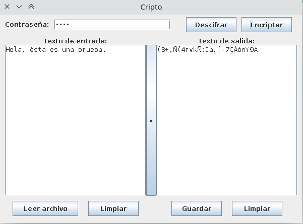

# Cripto
Programa que encripta/descifra mensajes mediante contraseña

El funcionamiento de este programa es muy intuitivo. Se escribe una contraseña que será la que se necesitará luego para recuperar la cadena de caracteres original. Se escribe el texto a encriptar o descifrar en el cuadro de texto de la izquierda y se pulsa sobre el botón Encriptar o el de Descifrar dependiendo de lo que se quiera hacer. En el cuadro de texto de la derecha aparecerá el resultado.

Si se quiere guardar el resultado en un archivo de texto se puede hacer mediante el botón Guardar. Lo mismo pasa si lo que se quiere es leer desde un archivo, en cuyo caso se deberá pulsar sobre Leer archivo.

El botón con < que se encuentra entre los dos cuadros de texto sirve para pasar el texto del cuadro de salida al de entrada.

